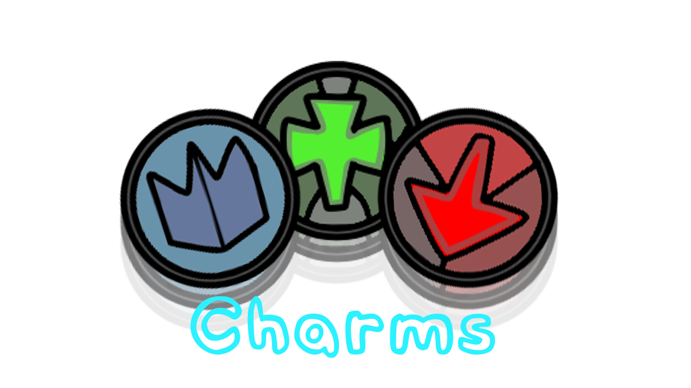
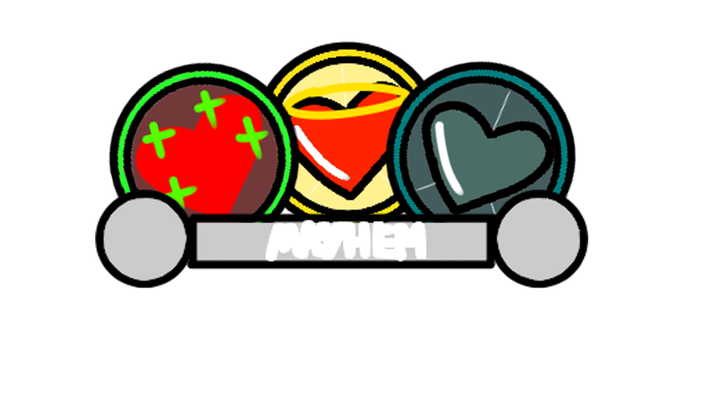
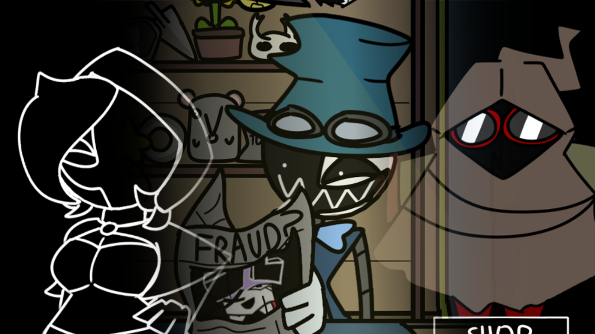
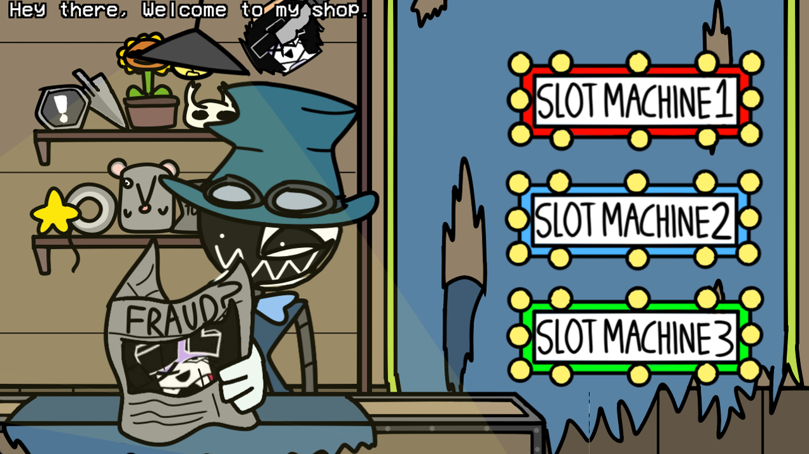
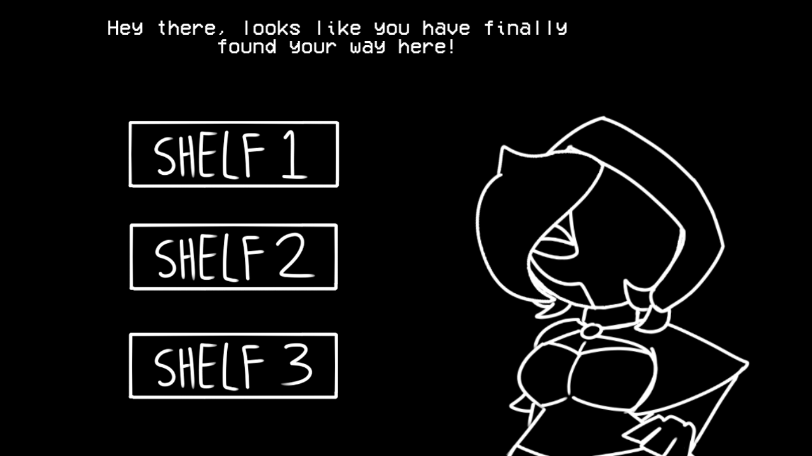
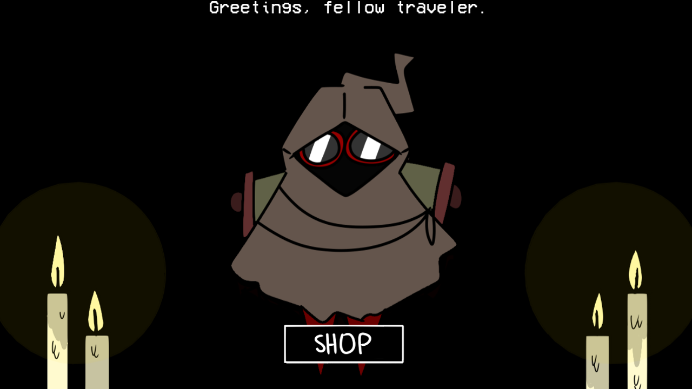
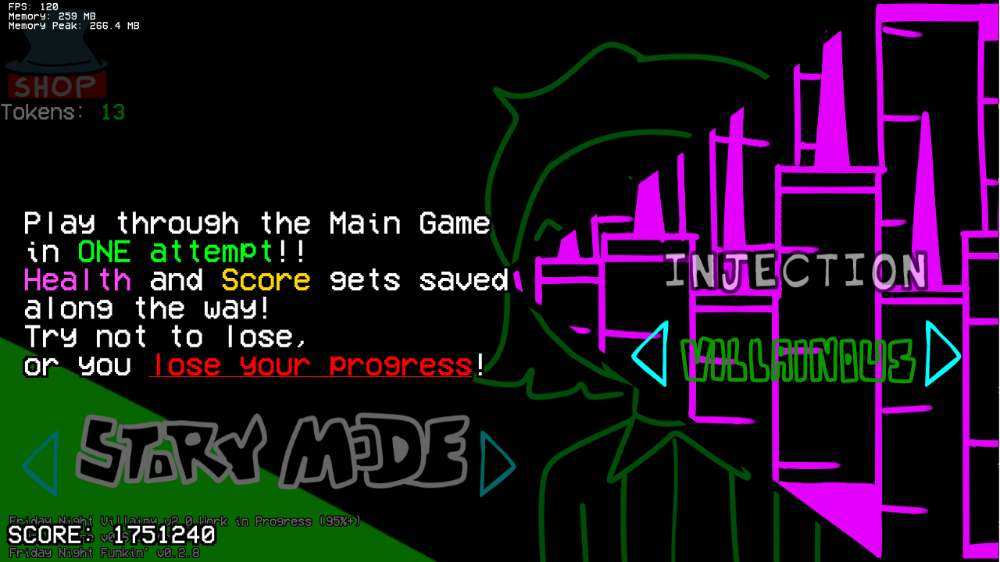
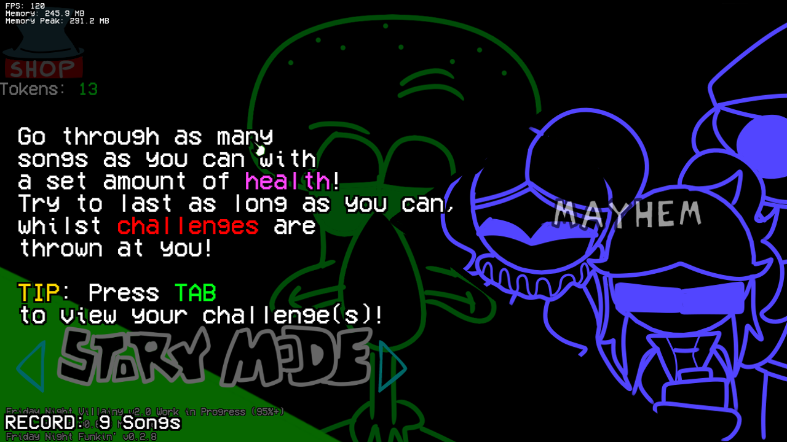

# Friday Night Villainy V2 - A Villainous Mayhem
A completely original FNF Mod built on top of [FNF: Psych Engine Version 0.6.3]([https://github.com/ShadowMario/FNF-PsychEngine/releases/tag/0.6.3](https://github.com/ShadowMario/FNF-PsychEngine/tree/0.6.3)).

### !!IMPORTANT! : This specific engine version has been completely modified, adding in new features and enhancements!!

_____________________________________
# Documenation
- [Compiling the game](#compilation-instructions)
- [New content](#new-content)
- [Debug features](#debug-features)

_____________________________________
# Compilation Instructions:
Psych Engine insists (rightfully) that you must have [the most up-to-date version of Haxe](https://haxe.org/download/).
For this mod specifically, it was made using [Haxe 4.2.5](https://haxe.org/download/version/4.2.5/), so it is mostly recommended you use that.

Now as regards the libraries you need to use to be able to compile the mod properly, you just have to run libs_install.bat.
TO NOT MESS WITH YOUR CURRENT LIBRARIES, BE SURE TO KEEP A BACKUP LIST OF YOUR CURRENT ONES!!!
_____________________________________
# New Content

## Charms

Charms play a major role when it comes to gameplay, as they help with beating any song easily. They can combat health drain, dodge mechanics, pop ups, and more, at the cost of wasting 1 token and using only 1 charm per song. These function with both the source code and lua, with the source code handling the state the charms are in, and lua handling each charm's mechanism.

## Buffs - Mayhem Bar

Buffs are also a great way to combat mechanics temporarily! Unlike charms, these can be used by filling up your "Mayhem Bar" by pressing notes correctly, and they can grant a small boost to your gameplay. No charges are made by using them, but you can only use 1 buff per song. Each one has a 10 second effect before going into a cool down, hence the "temporary effect". Just like charms, these also function with both the source code and lua, as the source coide handles the buff states, and lua handles each buff's mechanism.

## Shop(s)

The game itself has 3 shops in total, with each one working differently:

### Mimiko's Shop

Mimiko's shop offers 3 prize machines, each one containing a different set of various items. You can exchange 1 token to "gamble" your prize out, but if the price has already been claimed, you'll lose your token!

### Zeel's Shop

To your left from Mimiko's shop, Zeel wanders around with her illegal shop! She doesn't like gambling all that much, so she prefers to sell whatever Mimiko gives out at their normal prizes instead! Each shelf contains every item from each prize machine Mimiko has, so feel free to buy them instead using your tokens! Please don't be a pervert to her though.

### The Cellar Shop

Going upstairs from Mimiko's shop, you can find the Cellar, where the Hermit roams around. She doesn't accept tokens, but instead she accepts eggs. You can unlock various things as regards lore, or images...

## Minigames
Whatever mode you loaded on (except freeplay), you may stumble upon one of these 3 minigames: Coin Flip, Find the Token, Match the Cards. If you manage to beat each one, you can earn an extra token as an achievement, so be careful!

## New Gamemodes
This mod offers 5 total gamemodes: Classic Story Mode, Iniquitous Mode, Injection Mode, Mayhem Mode, Freeplay. While Classic and Iniquitous are similar, with Iniquitous being the harder version, Injection and Mayhem Modes vary:

### Injection Mode:

### Mayhem Mode:

These are just a few things the mod has to offer, so be sure to play it to check out every detail it has!

_____________________________________
# Debug Features

To enable debugging features of the mod, add this line of code inside [Project.xml](Project.xml): `<define name="DEBUG_ALLOWED"/> `

With it, you get:
- Access to the Master Editor Menu (Including ALL editors)
- Access to Chart Editor in PlayState
- Ability to 100% completing the game (Press V in Title Screen)
- Ability to hide ingame Discord Status